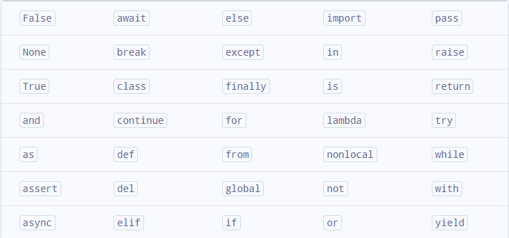

#GitHub python e outros
https://github.com/pyladiespb-org/python-world

## Canais de python
https://www.youtube.com/c/Did%C3%A1ticaTech/playlists

com exercícios
https://www.youtube.com/watch?v=U_A2kwUfmlw&list=PLvE-ZAFRgX8hnECDn1v9HNTI71veL3oW0

### POO
https://www.caelum.com.br/apostila-python-orientacao-a-objetos

### Curso de Flask
https://www.youtube.com/playlist?list=PL3BqW_m3m6a05ALSBW02qDXmfDKIip2KX

### Curso de Django
https://www.youtube.com/playlist?list=PLnDvRpP8BnewqnMzRnBT5LeTpld5bMvsj   
https://www.youtube.com/watch?v=DNGI5aD9MJs  
https://www.youtube.com/watch?v=_mkM6TtD8wc 

### Python birds
https://www.youtube.com/playlist?list=PLA05yVJtRWYTm0sIa6n56UpCjCsR5ekla

### App Engine e Python
https://www.youtube.com/playlist?list=PLA05yVJtRWYRGIeBxag8uT-3ftcMVT5oF

### 

### sites
https://www.programiz.com/python-programming/examples

### Aprendendo sobre Markdown
https://blog.da2k.com.br/2015/02/08/aprenda-markdown/

## identificadores
